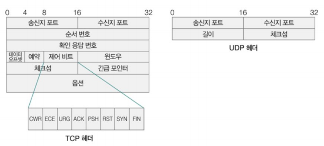
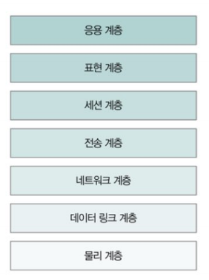
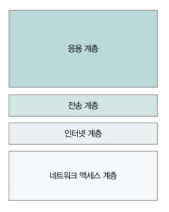

# [ 1주차 | Network | JSY ]

# 🖥️네트워크

# 5.1 네트워크의 큰 그림

## 📘 5.1 네트워크의 기본 구조

---

### ✅ 1. 네트워크의 기본 구조

**정의**: 네트워크란 **두 대 이상의 장치(호스트)가 서로 연결되어 데이터를 주고받을 수 있는 구조를 의미**

→ 주로 컴퓨터, 서버, 라우터, 스위치 등 장치 간 통신에 사용됨.

### 🔧 구성 요소:

- **호스트(Host)**: 데이터를 송수신하는 컴퓨터, 스마트폰 등
- **통신 회선(Transmission Line)**: 데이터를 실제로 전송하는 물리적 통로 (예: LAN 케이블, 광케이블)
- **네트워크 장비**: 라우터, 스위치, 허브 등 → 데이터 전달을 중계

### 💡 예시:

> 우리가 PC에서 웹사이트(예: www.naver.com)에 접속하면,
>
> → PC(호스트) → 공유기(라우터) → 인터넷 백본 → 네이버 서버(호스트)까지 데이터가 전달됨.
>
> ### ❓인터넷 백본이란?
>
> 인터넷 백본은 주로 대규모 네트워크에서 사용되는 개념으로 전 세계를 연결하는 초고속 데이터 고속도로라고 생각하면 된다.
>
> ### 🚗 비유: "도로와 자동차"
>
> 인터넷을 **전국 도로망**으로 비유하면 아래와 같다.
>
> | 구성 요소          | 인터넷에서의 의미 | 도로망에서의 역할 비유      |
> | ------------------ | ----------------- | --------------------------- |
> | 내 컴퓨터/스마트폰 | 사용자            | 동네에서 출발한 자동차      |
> | 공유기/지역망      | 지역 네트워크     | 동네 골목길                 |
> | ISP 통신사         | 인터넷 사업자     | 국도, 지방도                |
> | **인터넷 백본**    | 초고속 중심망     | **고속도로, 대륙 횡단도로** |
> | 구글/네이버 서버   | 목적지            | 서울, 부산 같은 대도시      |

---

### ✅ 2. LAN과 WAN

| 구분 | LAN (Local Area Network) | WAN (Wide Area Network)     |
| ---- | ------------------------ | --------------------------- |
| 영역 | 좁은 지역 (회사, 집 등)  | 넓은 지역 (국가 간, 인터넷) |
| 속도 | 빠름                     | 상대적으로 느림             |
| 비용 | 설치 비용 적음           | 비용이 큼                   |
| 예시 | 회사 내 PC 연결          | 인터넷, 통신망              |

### 💡 예시:

- **LAN**: 집에서 PC와 스마트폰이 공유기에 연결되어 통신
- **WAN**: 집의 공유기가 ISP망을 통해 유튜브 서버와 연결됨

### ❓ISP란

는 인터넷 서비스 제공자(Internet Service Provider)로 SKB, LG, KT와 같은 인터넷 서비스 제공자를 의미한다고 보면 된다.

---

### ✅ 3. 패킷 교환 네트워크

### ✅ 패킷(Packet)이란?

### 📌 정의:

> 패킷은 네트워크를 통해 전송되는 작은 데이터 조각입니다.
>
> 인터넷에서는 모든 데이터(문서, 이미지, 영상 등)를 **작게 나눠서** 패킷 단위로 전송한다.

### 🔧 왜 "작게 나눠서" 보낼까?

1. **대용량 데이터를 한 번에 보내기엔 위험하다.**

   → 도중에 끊기면 전체를 다시 보내야 함(많은 리소스 낭비)

2. **작은 조각으로 나누면 효율적**

   → 네트워크 혼잡도 감소, 손실된 부분만 재전송 가능

### 📦 패킷의 구조

패킷은 **두 부분(헤더+ 데이터)**으로 구성

| 구성 요소           | 설명                                             |
| ------------------- | ------------------------------------------------ |
| **헤더(Header)**    | 출발지 주소, 목적지 주소, 순서 등 전송 정보 포함 |
| **데이터(payload)** | 실제 전송할 내용 (예: 영상, 텍스트 등)           |

### 📮 패킷이 전송되는 과정

1. 사용자가 웹에서 유튜브 영상을 클릭
2. 영상 데이터가 1MB라면 → 1KB 단위로 **1000개의 패킷**으로 분할
3. 각 패킷은 **순번, 주소, 데이터**를 담아 전송
4. 서버 측은 순서대로 **조립**하여 전체 영상 재생

### 🔄 보낼 때

- **캡슐화**: 각 계층이 헤더를 붙이며 포장

### 📥 받을 때

- **역캡슐화**: 헤더를 하나씩 제거하며 해석

**정의**: 데이터를 작은 조각(패킷)으로 나누어 전송하고, 목적지에서 다시 조립하는 방식

→ 인터넷은 **패킷 교환** 방식을 사용함.

### 📡 패킷 전송 방식: ‘패킷 교환’

> 인터넷은 회선 교환이 아닌 패킷 교환(Packet Switching) 방식을 사용한다.

- 각각의 패킷은 **독립적으로 전송**
- 서로 **다른 경로**를 따라 도착할 수 있음
- 수신 측에서 **순서를 다시 맞추고 조립**

---

### 💡 현실 비유

### ✉️ 비유 ①: 편지와 봉투

- 편지를 쓸 때 → 내용이 많으면 **여러 봉투에 나눠서 보냄**
- 각 봉투에 **보내는 사람, 받는 사람, 편지 순번**을 적음
- 수신자가 받아서 **순서대로 읽음**

### 📦 비유 ②: 택배 배송

- 큰 상품은 **작은 박스 여러 개**로 나눠서 보내짐
- 박스마다 **배송지 주소와 순번**이 적혀 있음
- 택배사(네트워크 장비)는 박스를 **다른 경로로** 배송할 수 있음

### 특징:

- 각 패킷은 독립적으로 전송됨
- 같은 목적지라도 서로 다른 경로를 지나갈 수 있음
- 효율적이나, 순서가 바뀌거나 유실될 수 있음

### 💡 예시:

> 메일을 보낼 때, A4용지 전체를 한 번에 보내는 것이 아니라 여러 조각으로 나눠 보낸 뒤,
>
> 상대방이 이를 다시 **조합해서 읽는 방식**과 유사

---

### ✅ 4. 주소의 개념과 전송방식

### ▶ 주소의 개념

- **IP 주소**: 네트워크 상의 장치를 식별하는 주소 (예: 192.168.0.1)
- **MAC 주소**: 물리적인 네트워크 장비의 고유 주소 (하드웨어 주소)

### ▶ 전송방식

1. **유니캐스트**: 1:1 통신 (대부분의 인터넷 통신)
2. **브로드캐스트**: 1:모든 노드에게 (같은 네트워크 안에서)
3. **멀티캐스트**: 1:그룹 통신 (특정 그룹에만 전송)
4. **애니캐스트**: 1:가장 가까운 1과 통신(동일 그룹중 가장 가까운 호스트에게만 전송)

### 💡 예시:

- **유니캐스트**: 내가 유튜브 영상 하나 시청
- **브로드캐스트**: IP 충돌 검사 시 네트워크 전체에 요청
- **멀티캐스트**: 실시간 스포츠 중계를 다수의 사용자에게 전송
- **애니캐스트**: 가장 가까운 피자집 중 하나에 전화 → 자동으로 제일 가까운 지점이 응답

---

### ✅ 5. 두 호스트가 패킷을 주고받는 과정

1. 클라이언트는 서버에 데이터를 보냄 (예: 웹 요청)
2. 데이터는 패킷으로 분할됨
3. 라우터, 스위치 등 네트워크 장비를 거쳐 목적지로 이동
4. 서버가 응답을 다시 클라이언트에게 패킷으로 전송
5. 클라이언트는 패킷을 조립하여 응답을 받음

### 💡 예시:

> 크롬에서 www.google.com 검색 → DNS 조회 → IP로 요청 전송 → 응답 수신 → 브라우저에 화면 표시

---

### ✅ 6. 프로토콜(Protocol)

**정의**: 네트워크에서 통신하는 규칙과 약속

### 주요 프로토콜:

- **IP**: 주소를 기반으로 패킷 전달
- **TCP/UDP**: 데이터 전송 방식 (신뢰성 있는 vs 빠른)

- **HTTP/HTTPS**: 웹 페이지 전송
- **DNS**: 도메인 이름을 IP로 변환

### 💡 예시:

> 두 사람이 대화하려면 같은 언어(예: 한국어)를 써야 하듯,
>
> 컴퓨터끼리 통신도 **같은 프로토콜**을 사용해야 함

---

### ✅ 7. 네트워크 참조 모델

**정의**: 복잡한 통신 과정을 단계별로 나눈 개념적 모델

→ 대표적으로 **OSI 7계층**과 **TCP/IP 4계층**이 있음

> 모델이 존재하는 이유: 통신 구조를 표준화하고, 역할 분리하여 설계와 디버깅을 쉽게 하기 위해

---

### ✅ 8. OSI 7계층

| 계층 | 이름            | 설명                                  |
| ---- | --------------- | ------------------------------------- |
| 7    | 응용 계층       | 사용자에게 서비스 제공 (HTTP, FTP 등) |
| 6    | 표현 계층       | 데이터 형식, 암호화                   |
| 5    | 세션 계층       | 통신 연결 관리                        |
| 4    | 전송 계층       | 신뢰성 있는 전송 (TCP, UDP)           |
| 3    | 네트워크 계층   | 주소 지정, 경로 설정 (IP)             |
| 2    | 데이터링크 계층 | 오류 검출, MAC 주소 사용              |
| 1    | 물리 계층       | 전기 신호로 데이터 전송 (케이블 등)   |

### 💡 예시:

> 이메일을 보낼 때, OSI 7계층에 따라 데이터를 포장한 후 전송 → 상대방이 다시 계층을 따라 해석

---

### ✅ 9. TCP/IP 모델 (실제 인터넷에서 사용되는 구조)

| 계층 | 설명                        | OSI 대응 계층 |
| ---- | --------------------------- | ------------- |
| 4    | 응용 계층 (HTTP, FTP 등)    | 5~7계층       |
| 3    | 전송 계층 (TCP, UDP)        | 4계층         |
| 2    | 인터넷 계층 (IP 등)         | 3계층         |
| 1    | 네트워크 접근 계층 (LAN 등) | 1~2계층       |

### 💡 예시:

> 웹 페이지를 열 때, 브라우저는 응용 계층, TCP는 전송 계층, IP는 인터넷 계층을 담당

### 🎯 순서 정리: 데이터를 보낼 때 (송신 과정)

### ✅ [1] 응용 계층 (Application Layer)

- 사용자 행동: “유튜브에 접속”, “메시지 전송” 등
- 브라우저/앱이 만든 **데이터(payload)** 생성

👉 예: `GET /index.html HTTP/1.1`

---

### ✅ [2] 전송 계층 (Transport Layer)

- **데이터를 세그먼트로 분할**
- 신뢰성 제공 (TCP의 경우):
  - 순서 부여
  - 오류 검사
  - 흐름 제어

👉 헤더 추가: 포트 번호, 시퀀스 번호 등

예: `TCP 헤더 + HTTP 데이터`

---

### ✅ [3] 인터넷 계층 (Internet Layer)

- 목적지 **IP 주소** 추가
- **패킷 생성**: IP 헤더 + 전송 계층 데이터

👉 예: `IP 헤더 + TCP + HTTP`

---

### ✅ [4] 네트워크 접근 계층 (Network Access Layer)

- **MAC 주소**를 붙이고, **프레임(frame)**으로 변환
- 전기/무선 신호로 바꿔 전송

👉 예: `이더넷 프레임 = MAC 헤더 + IP 패킷`

### ❓MAC 주소란?

**MAC 주소(MAC Address)**는 네트워크 장비(컴퓨터, 스마트폰, 공유기 등)의

**물리적인 주소로 하드웨어마다 고유하게 할당된 식별 번호**이다.

### 🌐 MAC 주소 vs IP 주소

| 항목      | MAC 주소             | IP 주소                 |
| --------- | -------------------- | ----------------------- |
| 의미      | 하드웨어 식별자      | 네트워크 논리 주소      |
| 부여 시점 | 제조 시              | 네트워크 접속 시        |
| 범위      | **로컬** 네트워크 내 | **전 세계** 어디든      |
| 고정 여부 | 거의 고정            | 상황에 따라 바뀜 (DHCP) |
| 예시      | `00:1A:2B:3C:4D:5E`  | `192.168.0.15`          |

### 📌 요약

| 단계 | 주요 작업       | 관련 주소/프로토콜            |
| ---- | --------------- | ----------------------------- |
| 1    | 요청 생성       | 응용 계층 (HTTP 등)           |
| 2    | TCP/UDP 캡슐화  | 전송 계층 (포트 번호 포함)    |
| 3    | IP 헤더 추가    | 인터넷 계층 (IP 주소)         |
| 4    | MAC 헤더 추가   | 네트워크 접근 계층 (MAC 주소) |
| 5    | 전송            | 물리 계층 (케이블, 무선)      |
| 6    | 수신 → 역캡슐화 | 반대 순서로 헤더 제거         |

### 흐름 정리

- **사용자는 IP 주소로 요청을 보냄**
- **네트워크 장비는 MAC 주소를 통해 물리적 위치를 찾아 데이터 전송**
- **TCP/UDP는 데이터 전송 신뢰성과 방식을 결정**
- **IP 주소는 네트워크 내 논리적 위치 지정**
- **MAC 주소는 같은 네트워크 안에서 실제 물리적 위치 지정**

---

### ✅ 10. 캡슐화(Encapsulation)와 역캡슐화(Decapsulation)

### 📦 캡슐화: 상위 계층의 데이터를 하위 계층에서 **포장**

- 각 계층은 **자기 계층의 헤더**를 붙여서 전달
- 송신 측에서 위 → 아래로 진행

### 🔓 역캡슐화: 받은 데이터를 계층별로 **해석하고 꺼냄**

- 수신 측에서 아래 → 위로 진행

### 💡 예시:

> 택배 보낼 때: 상자에 물건을 넣고 포장(캡슐화) → 도착 후 포장 뜯고 내용물 확인(역캡슐화)
